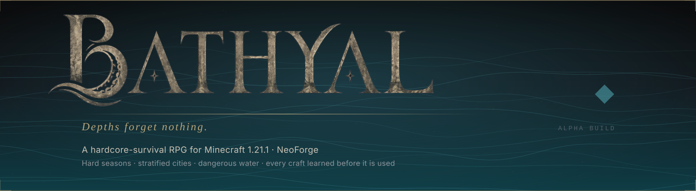
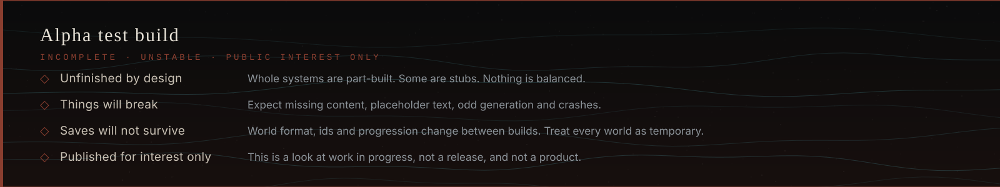
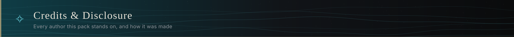
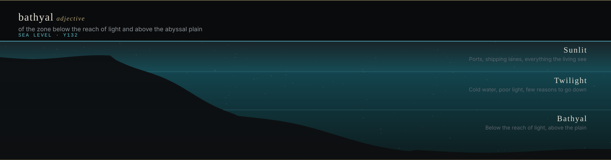

&nbsp;
&nbsp;
&nbsp;

**[◈ &nbsp;Download the build](https://github.com/TAS-69/bathyal/releases)** &nbsp;·&nbsp;
**[▤ &nbsp;Wiki](https://github.com/TAS-69/bathyal/wiki)** &nbsp;·&nbsp;
**[◆ &nbsp;Roadmap](https://github.com/TAS-69/bathyal/wiki/Roadmap)** &nbsp;·&nbsp;
**[✧ &nbsp;Credits](CREDITS.md)** &nbsp;·&nbsp;
**[✦ &nbsp;AI disclosure](AI-DISCLOSURE.md)** &nbsp;·&nbsp;
**[▪ &nbsp;Licence](#licence)**

A large, map-driven world where survival is the baseline, every craft has to be learned before it can be used,
and geography shapes how its societies live.

Bathyal's custom world generator combines a multi-layered map system for terrain, coastlines, biomes, climates,
settlements and roads. It builds the same canonical geography into playable blocks each time: cities with districts
and slums, walls that close, harbours you can walk cargo onto, and roads that join them. The society you land in is
stratified and prejudiced by design; your race changes the price you pay and the work you are offered.

### ▸ Explore the wiki

The world, its peoples and their recorded history, every system and every skill tree are in the **[wiki](https://github.com/TAS-69/bathyal/wiki)** — spoiler-free.

## ▸ This is an alpha test build

**This is not a release, and it is not a product.** It is a work in progress made public so people can look at it.
Please read this part before you download anything.

- **Content is still incomplete.** The world, settlements and major systems described in the wiki are real and generating. The
  current implementation, controlled runtime checks and remaining acceptance are recorded in the
  **[roadmap](https://github.com/TAS-69/bathyal/wiki/Roadmap)** on the wiki. Quest coverage, late-game content, balance and polish still need substantial work.
- **Features may be broken.** Some systems are stubs. Some are wired in but untuned. Expect placeholder text,
  missing recipes, odd generation, unbalanced numbers and crashes.
- **Worlds will not survive updates.** Identifiers, world format and progression change between builds. Treat any
  world you make as temporary; do not get attached to it.
- **There is no support and no schedule.** Bug reports are welcome and read. Nothing is promised.

If you want a finished modpack, this is not one yet. If you want to watch one being built, you are in the right place.

### What you need

| | |
|---|---|
| **Minecraft** | 1.21.1 — bought and owned separately; nothing of Mojang's is distributed here |
| **Loader** | NeoForge 21.1.250 (the launcher installs it from the package) |
| **Java** | 21 |
| **Launcher** | anything that imports a Modrinth `.mrpack` — Prism Launcher, the Modrinth App, ATLauncher |
| **Memory** | 8 GB allocated is a sensible starting point |
| **Note** | Distant Horizons ships at a 64-chunk radius and is by far the heaviest thing in the pack. Turn it down first if you struggle. |

### How to install

1. Download the latest `.mrpack` from **[GitHub Releases](https://github.com/TAS-69/bathyal/releases)**.
2. In Prism Launcher: **Add Instance → Import → Modrinth pack**, and pick the file.
   In the Modrinth App: **Import → From file**.
3. Let it resolve. Nearly all of the mods are fetched from their authors' own pages at this point, so the first import
   needs a connection and a few minutes.
4. Launch. Expect the first world load to take a while — the terrain is read from image data.

### At a glance

| | | | |
|---|---|---|---|
| **World** 12.3 km, map-driven | **Settlements** 40 · 3,106 buildings | **Harbours** 21 · 71 piers | **Roads** 121 |
| **Races** 6 playable | **Callings** 23 | **Skill trees** 25 | **Quests** 335 |
| **Mods** 110 | **Sea level** Y132 | **Custom mod** BathyalGen 0.97.6 | **Build** v0.11.31 alpha |

Figures are read from this public package. Every mod and what changed: **[the current build notes](releases/v0.11.31.md)** · what is built and tested: **[the roadmap](https://github.com/TAS-69/bathyal/wiki/Roadmap)**.

**This pack is a curation first.** Most of what you will touch was written by other people and given away for
free. Every one of them is named, with their licence and their page, in **[CREDITS.md](CREDITS.md)** — including
**Matt Dillow (Maffhew)**, whose **Excalibur** resource pack is this pack's entire texture identity.

**AI tools are used extensively throughout Bathyal** across its code, writing, artwork, music, ambience and NPC
voices. The project's design and direction remain human-led, with generated work reviewed, edited and integrated
before it enters the pack. The workflow is described in **[AI-DISCLOSURE.md](AI-DISCLOSURE.md)**.

### ▪ Licence

- **Code, scripts and tooling** that belong to this project — **[MIT](LICENSE)**.
- **Creative content** — world, lore, characters, design writing and art — **[All Rights Reserved](LICENSE-CONTENT)**.
- **Third-party mods, the resource pack and the shader** keep their own licences, which are listed per item in
  **[CREDITS.md](CREDITS.md)**. This project is non-commercial and carries no monetised links.

### ▪ Reporting something

Open an issue. Crashes, generation faults, broken quests, wrong attribution and takedown requests are all welcome
here — the last two are acted on without argument.

