

&nbsp;
&nbsp;
&nbsp;

**[◈ &nbsp;Download the build](https://github.com/TAS-69/bathyal/releases/tag/v0.10.88)** &nbsp;·&nbsp;
**[◆ &nbsp;What's in it](releases/v0.10.88.md)** &nbsp;·&nbsp;
**[✧ &nbsp;Credits](CREDITS.md)** &nbsp;·&nbsp;
**[✦ &nbsp;AI disclosure](AI-DISCLOSURE.md)** &nbsp;·&nbsp;
**[▪ &nbsp;Licence](#licence)**

---

A large, map-driven world where survival is the baseline, every craft has to be learned before it can be used,
and geography shapes how its societies live.

Bathyal's custom world generator combines a multi-layered map system for terrain, coastlines, biomes, climates,
settlements and roads. It builds the same canonical geography into playable blocks each time: cities with districts
and slums, walls that close, harbours you can walk cargo onto, and roads that join them. The society you land in is
stratified and prejudiced by design; your race changes the price you pay and the work you are offered.

## ▸ This is an alpha test build

**This is not a release, and it is not a product.** It is a work in progress made public so people can look at it.
Please read this part before you download anything.

- **Content is still minimal.** The world, the settlements and the systems below are real and generating, and of
  **62 tracked systems 48 are built and wired** — but that is the engineering. The *content inside it* — quests,
  dialogue, items, bosses, balance — is thin, and almost none of it has been played by anybody.
- **Features may be broken.** Some systems are stubs. Some are wired in but untuned. Expect placeholder text,
  missing recipes, odd generation, unbalanced numbers and crashes.
- **Worlds will not survive updates.** Identifiers, world format and progression change between builds. Treat any
  world you make as temporary; do not get attached to it.
- **There is no support and no schedule.** Bug reports are welcome and read. Nothing is promised.

If you want a finished modpack, this is not one yet. If you want to watch one being built, you are in the right place.

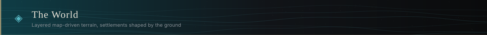

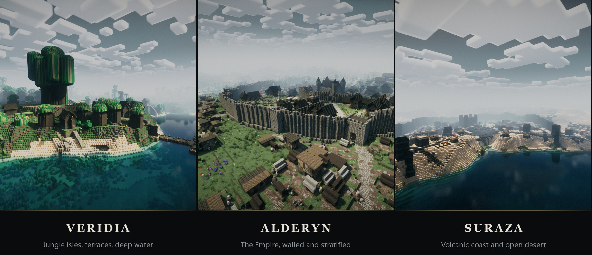

**Three lands and a drowned one.** **Alderyn**, the human empire — snow to taiga to temperate to plains.
**Veridia**, the jungle isles. **Suraza**, volcanic waste. And **Anthara** in the middle of them, under the water.
Roughly **12.3 km** across, with the sea at **Y132**.

The custom generator combines layered terrain, biome, climate and coastline maps rather than terrain noise, so the
world is the same shape every time and its geography means something: a climate band you can walk through, a
frontier that is hostile for a reason, shipping lanes that exist because the ports are where they are.

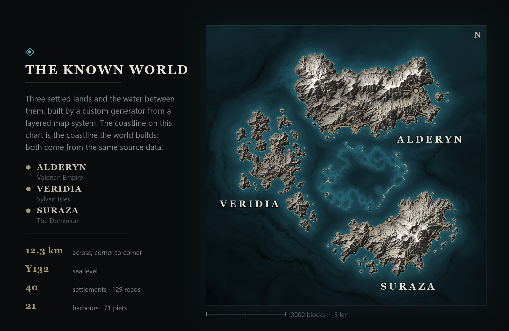

The chart above is drawn from the same image the generator reads, at the same coordinates, so its coastline is
the coastline the world builds.

> **Recorded history** — the lands were once one, until the **Cataclysm** some five centuries ago shattered
> the continents and drowned Anthara; the Church calls it the *Shattering of the Sun*. A century ago the hero
> **Valerion** united the human tribes under the Holy Light and raised the **Valerian Empire**, driving the
> demi-humans from Alderyn. Today three powers watch each other across dangerous seas, the demi-humans serve
> beneath the human order, and the southern frontier smoulders.

### Settlements that were planned, not scattered

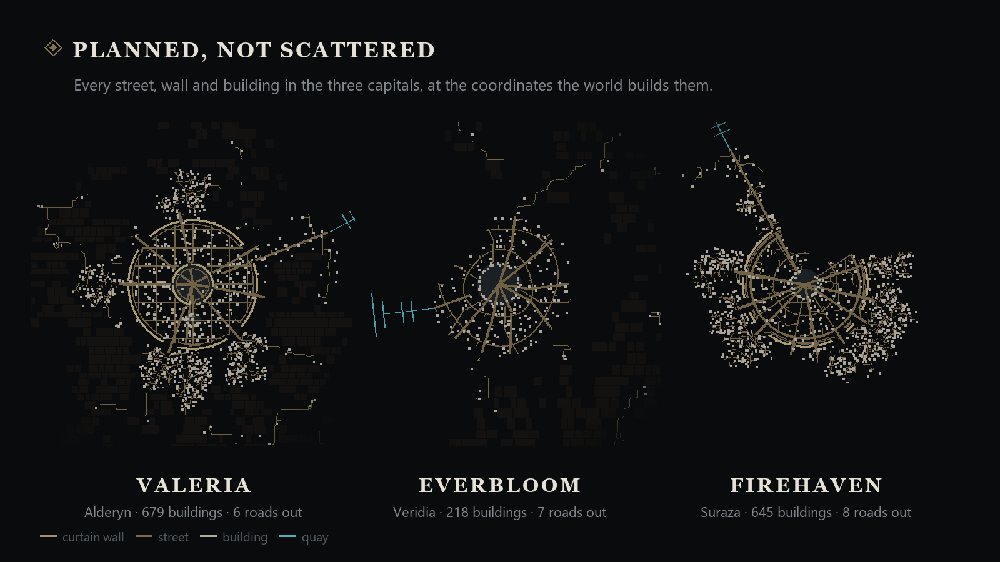

**40 settlements** — capitals, cities with districts and slums, towns and villages, **3,841 buildings** in all —
built with architecture that differs by culture, furnished interiors, walls that close with gatehouses and towers,
farmland belts, and **129 roads** joining them. **21 harbours** carry **71 piers**, with railed quays, bollards,
cargo and cranes, and real port buildings ashore: harbourmaster's tower, customs house, storehouses, ropewalk,
slipways, shipwrights, chandlery, sailors' inn, lighthouses.

Streets are meant to be walked. Stairs appear wherever paving steps; every doorway, gateway and quay is joined to
its road in one-block gradients, cut into the bank where it has to be; a walled town keeps a lane inside its
rampart so no street simply ends at masonry. Shopfronts are shaped by trade — a baker's oven, a smith's forge bay,
a tailor's jettied upper floor, a herbalist's glasshouse — and the squares have benches, handcarts, woodpiles,
washing lines, tethered animals and lamps at night.

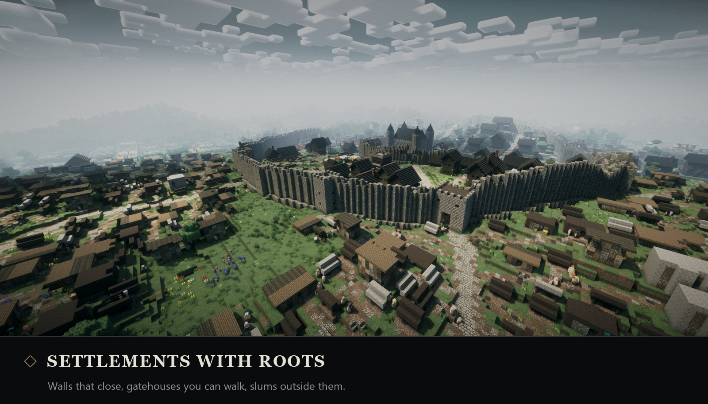

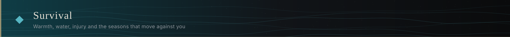

Warmth, thirst and injury are always pressing, and four seasons move every climate band against you. You start
with nothing and no training: untrained hands get twigs, pebbles, flowers and small game, and every tier of block,
food and hide above that has to be learnt before you can take it.

- **Temperature, thirst and localised injury**, with a harder injury model available.
- **Water and fire the long way** — a leather waterskin, a twig-and-pebble fireplace, boiling to purify.
- **Clothing, not armour** — garments worn in their own slots that insulate you against the climate you are in.
- **Food spoils.** Seasons change what grows and when.
- **Death costs you** — a grave with timed decay, dropped currency to recover, and a reputation that remembers.

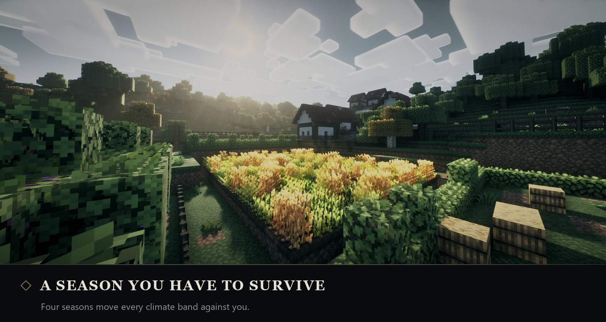

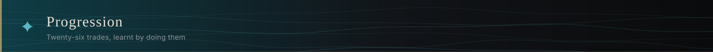

**Twenty-six trades, levelled by doing them.** Each tree runs 27–42 nodes with exclusive keystone forks and six
capstones, so two players in the same trade end up mechanically different rather than converging on one build.
Nodes unlock harvests, recipes, stats and abilities. One tree stays hidden until it is found.

**Magic is studied, not bought.** Three schools — Nature, Forge and Holy — each with lectern study, a bound first
spell, a grimoire filled by the trees, mana wells and its own arts. People will judge you for casting.

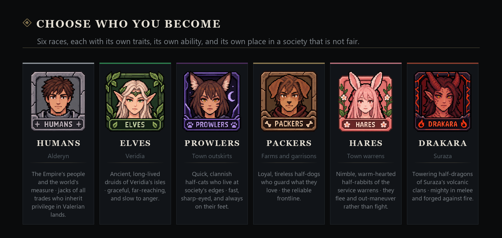

**Six races**, each with passive traits and one activated ability. Every race also has disciplines it learns
more slowly, because of what it is and how it lives — never barred from anything, only slower. The difficulty you
choose at character creation also sets the rate at which you learn, and it says so on the contract you sign.

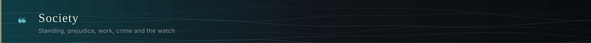

**Standing works three ways at once**: your faction tier, your standing in a particular settlement, and what an
individual thinks of you personally. All three shape prices, greetings and what work you are offered — and your race sets where you start.

Conversation varies by faction, mood and race, with local rumours, odd jobs and personal quests, and a place
remembers what has happened in it. There is a currency, appointed shopkeepers with daily stock and regional
catalogues, and private trade with any resident. There is also crime: a stealth system, pickpocketing and theft,
and a watch that arrests you when you are seen — followed by a fine, a cell or a fight. Townsfolk are proper
residents in trade dress, with names and voices that match who they are, and regional demographics that change as
you travel.

**No vanilla monsters wander the overworld.** Bandits, predatory wildlife and stranger things take their place,
and helping a settlement fight them off raises your standing there.

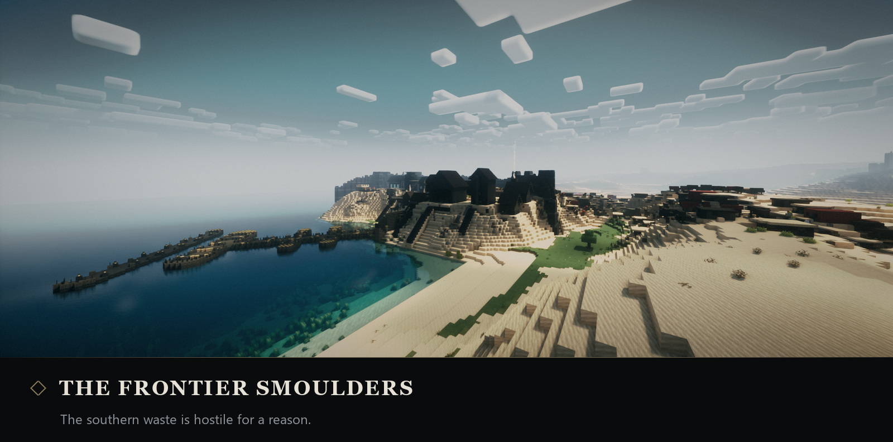

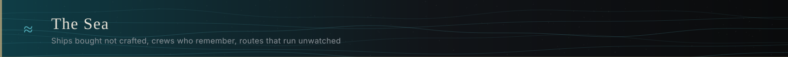

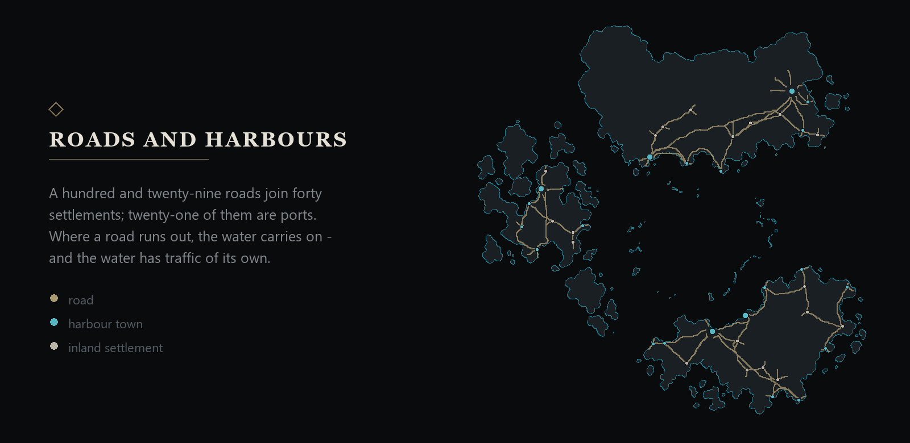

**Ships are bought, never crafted** — from quayside shipwrights, with refit yards for hull, rigging and ram, and
gunsmiths for cannon. Every hand you hire keeps a name, a level earned at sea and a bond that moves with voyages,
victories, bonuses and wages; miss the wages for three days and the unhappiest of them desert. At level 4 a hand
picks one of three roads for their class, permanently. The books survive the ship, and they survive your death.

You name her, choose her sail colour, device and home port, and carve a figurehead that does something. A whistle
near water calls her round to berth nearby.

**The sea runs whether you are watching or not.** Every hull on the map is advanced once a second as an abstract
record and only given a body when a player comes near, so trade and piracy are continuous rather than spawning in
around you. Merchantmen run real port-to-port routes over a sailing chart taken from the world's own seabed,
unload, re-cargo and sail on. Patrols hunt pirates. Pirates hunt everyone, hold a broadside on you, board, and run
when it turns — and sinking one leaves her cargo floating.

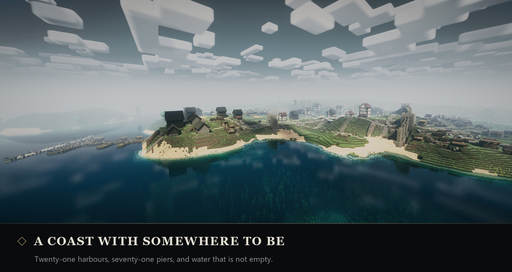

### What you need

| | |
|---|---|
| **Minecraft** | 1.21.1 — bought and owned separately; nothing of Mojang's is distributed here |
| **Loader** | NeoForge 21.1.250 (the launcher installs it from the package) |
| **Java** | 21 |
| **Launcher** | anything that imports a Modrinth `.mrpack` — Prism Launcher, the Modrinth App, ATLauncher |
| **Memory** | 8 GB allocated is a sensible starting point |
| **Note** | Distant Horizons ships at a 64-chunk radius and is by far the heaviest thing in the pack. Turn it down first if you struggle. |

### How to install

1. Download `Bathyal-0.10.88.mrpack` from **[the current alpha release](https://github.com/TAS-69/bathyal/releases/tag/v0.10.88)**.
2. In Prism Launcher: **Add Instance → Import → Modrinth pack**, and pick the file.
   In the Modrinth App: **Import → From file**.
3. Let it resolve. Nearly all of the mods are fetched from their authors' own pages at this point, so the first import
   needs a connection and a few minutes.
4. Launch. Expect the first world load to take a while — the terrain is read from image data.

### What is in the package

**109 mods** — 105 fetched from their authors' pages at install, 4 carried inside — the pack's own configuration
and scripting, the custom **BathyalGen** mod (0.96.68), the Excalibur resource pack, and the pack's own audio and
art. The full manifest — every mod, what the pack ships of its own, and what changed — is in
**[releases/v0.10.88.md](releases/v0.10.88.md)**.

### At a glance

| | | | |
|---|---|---|---|
| **World** 12.3 km, map-driven | **Settlements** 40 · 3,841 buildings | **Harbours** 21 · 71 piers | **Roads** 129 |
| **Races** 6 playable | **Callings** 23 | **Skill trees** 26 | **Quests** 335 |
| **Mods** 109 | **Sea level** Y132 | **Custom mod** BathyalGen 0.96.68 | **Build** v0.10.88 alpha |

Figures are read from the build itself and checked by an automated audit before each package is made.

**This pack is a curation first.** Most of what you will touch was written by other people and given away for
free. Every one of them is named, with their licence and their page, in **[CREDITS.md](CREDITS.md)** — including
**Matt Dillow (Maffhew)**, whose **Excalibur** resource pack is this pack's entire texture identity.

**AI tools are used extensively throughout Bathyal** across its code, writing, artwork, music, ambience and NPC
voices. The project's design and direction remain human-led, with generated work reviewed, edited and integrated
before it enters the pack. The workflow is described in **[AI-DISCLOSURE.md](AI-DISCLOSURE.md)**.

### ▪ Licence

- **Code, scripts and tooling** that belong to this project — **[MIT](LICENSE)**.
- **Creative content** — world, lore, characters, design writing and art — **[All Rights Reserved](LICENSE-CONTENT)**.
- **Third-party mods, the resource pack and the shader** keep their own licences, which are listed per item in
  **[CREDITS.md](CREDITS.md)**. This project is non-commercial and carries no monetised links.

### ▪ Reporting something

Open an issue. Crashes, generation faults, broken quests, wrong attribution and takedown requests are all welcome
here — the last two are acted on without argument.

